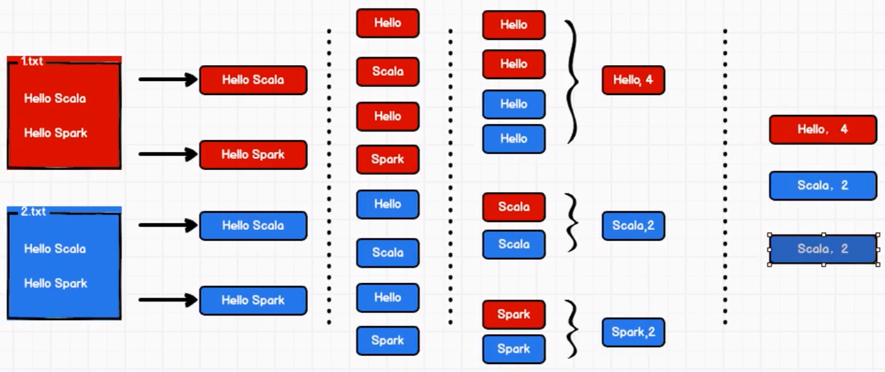

# chapter 01

+ Spark

基于内存、通用、可扩展的大数据计算引擎，由 Scala 开发

+ Spark & Hadoop

Hadoop 一次性数据计算：拿出来，mapper，分布式算，reduce，存结果；每次拿出来和存结果都有磁盘交互，复杂（如迭代式）计算中效率低

Spark 流数据：基于内存，not 磁盘，不用来回取了，效率高

+ Spark 核心模块

底层 Core，上边 4 个：SQL Streaming MLlib GraphX

+ Quick Start
    1. 安装 Scala 插件 课程里环境 spark3.0 scala2.12
    2. 创建 maven 项目 spark-core，add framework support 加上 scala
    3. core.Test 测试环境
  

出现 bug：`错误: 找不到或无法加载主类 core.Test`

原因：找不到 scala，

解决：将 2.13 版本换成了 2.12 版本重装了一下，测试代码跑通了

但是，terminal 里 scala 命令不能运行

解决：下载安装了一个 scala，并配置 bin 环境变量

+ WordCount 词频统计

添加依赖，代码开发：`package core.wordcount`

出现 3 个 bug

bug 1：`ERROR Shell: Failed to locate the winutils binary in the hadoop binary path`

安装 hadoop：[https://blog.csdn.net/weixin_43719616/article/details/116699376](https://blog.csdn.net/weixin_43719616/article/details/116699376)

bug 2：`ERROR SparkContext: Error initializing SparkContext.org.apache.spark.SparkException: A master URL must be set in your configuration`

bug 3：`Exception in thread "main" org.apache.spark.SparkException: A master URL must be set in your configuration`

原因：new SparkContext() 里没有放 sparkConf 😂

解决：`val sc = new SparkContext()` => `val sc = new SparkContext(sparkConf)`

+ [idea 编写scala提示variable 和 specify type 设置](https://www.cnblogs.com/itBulls/articles/9488218.html)

