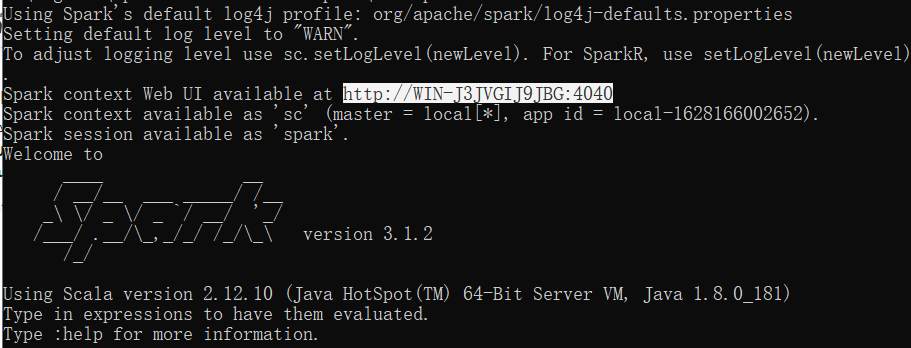
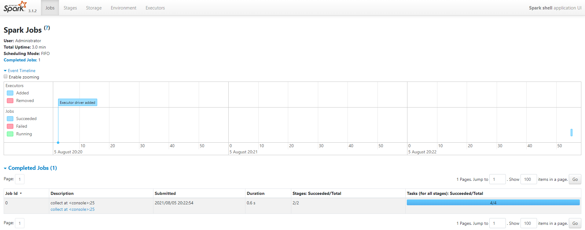
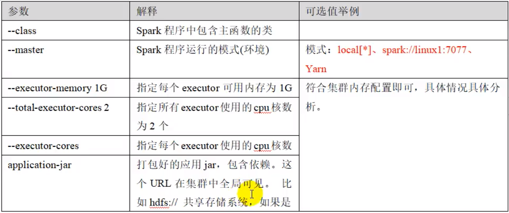

# chapter 02

+ 运行环境
    1. 本地模式
    2. 独立模式
    3. YARN3
    
+ [安装并配置环境变量](https://blog.csdn.net/qq_42754919/article/details/109402379)

安装成功：

```bash
D:\bigdata\spark-3.1.2-bin-hadoop3.2\bin>spark-shell
Using Spark's default log4j profile: org/apache/spark/log4j-defaults.properties
Setting default log level to "WARN".
To adjust logging level use sc.setLogLevel(newLevel). For SparkR, use setLogLevel(newLevel).
Spark context Web UI available at http://WIN-J3JVGIJ9JBG:4040
Spark context available as 'sc' (master = local[*], app id = local-1628087798669).
Spark session available as 'spark'.
Welcome to
      ____              __
     / __/__  ___ _____/ /__
    _\ \/ _ \/ _ `/ __/  '_/
   /___/ .__/\_,_/_/ /_/\_\   version 3.1.2
      /_/

Using Scala version 2.12.10 (Java HotSpot(TM) 64-Bit Server VM, Java 1.8.0_181)
Type in expressions to have them evaluated.
Type :help for more information.

scala>
```

命令行一行代码进行 WordCount

```bash
scala> sc.textFile("Z:/IDEA Project/big-data/spark/data/1.txt").flatMap(_.split(" ")).map((_,1)).reduceByKey(_+_).collec
t
res9: Array[(String, Int)] = Array((scala,1), (hello,2), (spark,1))
```

+ spark 监控界面





+ Standalone 模式

独立部署模式、主从模式

一个 Master-Worker 多个 Worker

从 : slave.template
```sh
worker1
worker2
worker3
```

主 : spark-env.sh
```sh
export JAVA_HOME=path
SPARK_MASTER_HOST=worker1
SPARK_MASTER_PORT=7077
```

分发
```bash
xsync spark-tandalone
```

启动集群
```bash
sbin/start-all.sh
```

提交应用
```bash
bin/spark-submit --class org.apache.spark.examples.SparkPi \
--master spark://worker1:7077 ./examples/jars/spark-examples_2.12-3.0.0.jar 10
```

参数说明


+ 配置历史服务

查看执行过的服务

+ 高可用

可以配置多个 Master, 一个工作 Alive, 其它备用 Standby

+ 端口号

spark-shell 计算任务运行端口 4040
spark 内部 master 通信端口 7077
standalone 模式下 spark master web 资源端口 8080
spark 历史服务端口 18080
hadoop YARN 任务运行端口 8088