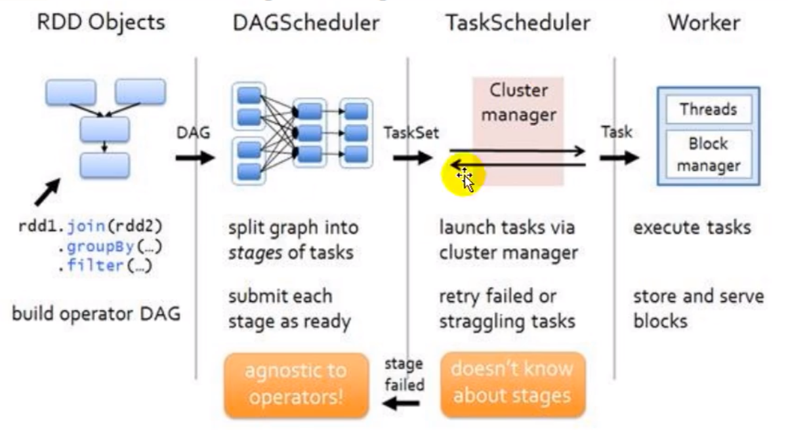

# chapter 04
spark 核心编程 = RDD + 累加器 + 广播变量

+ 累加器

分布式共享只写变量

+ 广播变量

分布式共享只读变量

## RDD

Driver 与 Executor 的通信:

代码在 package test

简单模拟分布式计算:

代码在 package test2

stack.scala 相当于数据结构框架, subtask.scala 是真·task

+ RDD

弹性分布式数据集

+ 弹性
    1. 存储：内存与磁盘的自动切换
    2. 容错：数据丢失可以自动恢复
    3. 计算：计算出错重试机制
    4. 分片（分区）：根据需要重新分片
    
+ 分布式

数据存储在大数据集群不同节点上

+ 数据集

RDD 封装了计算的逻辑，不存储数据

+ 数据抽象

RDD 是一个抽象类，需要子类具体实现

+ 不可变

RDD 封装的计算逻辑不能发生改变

+ 可分区 并行计算

+ Others

RDD 是最小计算单元，逻辑不能太复杂，以便能复用

Driver 将任务分成多个 task( = **RDD** + 分配的资源 ) 分配给不同的 executor

RDD 的数据处理方式类似于 IO 流，也有装饰者模式

RDD 的数据只有在调用 collect 方法时才会真正执行业务逻辑操作，之前的操作只是在定义

RDD 是不保存数据的，但 IO 有 buffer 可以临时保存数据

+ 核心属性
    1. 分区列表，并行计算
    2. 每个分区都有计算（相同的计算逻辑）
    3. RDD 有 0 个或多个 dependency
    4. 分区器 将数据分区的工具
    5. 在每个分区计算时都有一个首选的位置（ 找效率最优的 executor ），移动数据不如移动计算
    

+ 执行原理

## 基础编程

+ RDD 创建: package rdd.builder
    1. 从内存（集合）中创建 ※
    2. 从外部存储文件创建 ※
    3. 从其他 RDD 创建
    4. 直接创建
  
3 和 4 一般在源码里使用，代码中一般用 1 和 2
  
+ RDD 的并行度和分区

package rdd.builder xxxPar.scala

### RDD 方法
+ RDD 方法 => RDD 算子

1. 转换：功能的补充和封装，旧的 RDD 包装成新的 RDD，如 map flatMap
2. 行动：触发任务的调度和作业的执行，如 collect
  

#### RDD 转换算子

代码 package rdd.operator.transform

##### value 类型

1. map 转换映射

2. mapPartitions

3. mapPartitionsWithIndex 能看到分区编号

4. flatMap

5. glom

6. groupBy

7. filter

8. sample

9. distinct

10. coalesce

11. repartition

12. sortBy

##### 双 value 类型

13. intersection

14. union

15. subtract

16. zip

##### key - value 类型

17. partitionBy

18. reduceByKey

19. groupByKey

从 shuffle 的角度: reduceByKey 和 groupByKey 都存在 shuffle 的操作，但是 reduceByKey 可以在 shuffle 前对分区内相同 key 的数据进行预聚合(combine)功能，这样会减少落盘的数据量，而 groupByKey 只是进行分组，不存在数据量减少的问题，reduceByKey 性能更高。

从功能的角度: reduceByKey 其实包含分组和聚合的功能。GroupByKey 只能分纽，不能聚合，所以在分组聚合的场合下，推荐使用 reduceByKey，如果仅仅是分组而不需要聚合，那么还是只能使用 groupByKey。

20. aggregateByKey

21. foldByKey

22. combineByKey

23. join

24. leftOuterJoin rightOuterJoin

25. cogroup

#### RDD 行动算子

行动算子：触发作业执行的方法，底层调用的是环境对象的 runJob 方法

底层代码中会创建 ActiveJob，并提交执行

1. reduce

2. collect

3. count

4. first

5. take

6. takeOrdered

7. aggregate

8. fold

9. countByValue countByKey

wordcount 的多种实现方式：package wordcount.Spark04_WordCount

10. save

11. foreach

### RDD 序列化

+ 闭包检测：检查是否序列化了

+ Kryo 序列化框架

速度是 Serializable 的十倍

当 RDD 在 Shuffle 数据的时候，简单数据类型、数组和字符串类型己经在 Spark 内部使用 Kryo 来序列化

内部就是这么做的，不用自己写 😂

### RDD 依赖关系

代码：package rdd.dep

禁止环形依赖

每个 RDD 都会保存血缘关系

一旦出现错误，可以根据血缘关系将数据源重新读取进行计算

OneToOne(窄) 依赖 & shuffle(宽) 依赖

rdd 看似是从前往后执行的，实际上是先调用后边的 rdd，再一层一层递归计算前边的 rdd

+ 划分阶段 Stage

需要 shuffle 的地方，必须等待相关 rdd 都执行完，因为要重新分区

+ 任务划分

Application(SparkContext) -> Job( Action 算子 ) -> Stage(shuffleDependency 的个数 + 1) -> Task(一个 Stage 阶段中，最后一个 RDD 的分区个数就是 Task 的个数)

每一层都是 1 对 多

### RDD 持久化

代码：package rdd.persist

+ RDD CheckPoint 检查点

### RDD 分区器

代码：package rdd.partition

自定义分区器:
1. 继承 Partitioner
2. 重写方法

### RDD 文件读取与保存

代码：package rdd.io