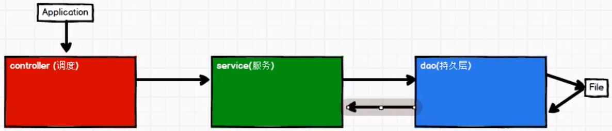

# chapter 05 
案例实操

代码：package req

## 数据

user_visit_action.txt

电商网站用户行为（搜索、点击、下单、支付）数据

+ 数据格式

日期(YYYY-MM-DD)_用户ID(Int)_SessionID(String)_页面ID(Int)_动作时间(YYYY-MM-DD HH:mm:ss)_搜索关键字

搜索关键字 里面有好多字段
1. 第一个字段不为 null，则为搜索行为，字段即为搜索内容
2. 第二三个字段不为 -1，则为点击行为，第二个是商品类别 ID，第三个是产品 ID
3. 第四五个字段不为 null，则为下单行为，第四个是商品类别 ID 集合，第五个是产品 ID 集合，下单可能是多个，通过逗号`,`分隔
4. 第六七个字段不为 null，则为支付行为，第六个是商品类别 ID 集合，第七个是产品 ID 集合，支付也可能是多个，通过逗号`,`分隔
5. 第八个字段是城市 ID

### 需求 1 热门商品 top10

热门综合排名 ~ 1.点击 20%  +  2.下单 30%  +  3.支付 50%

### 需求 2 top10 热门品类中每个品类的 top10 活跃 session 点击统计

### 需求 3 页面单跳转换率

## 工程化代码 三层架构
1. controller 控制层：调度
2. service 服务层：服务的逻辑
3. dao 持久层：数据、文件

以 wordCount 举例的代码实现：package framework

+ util 和 common 的区别

util 在哪都能用，common 是共通性代码被抽取出来的

+ bean 实体类